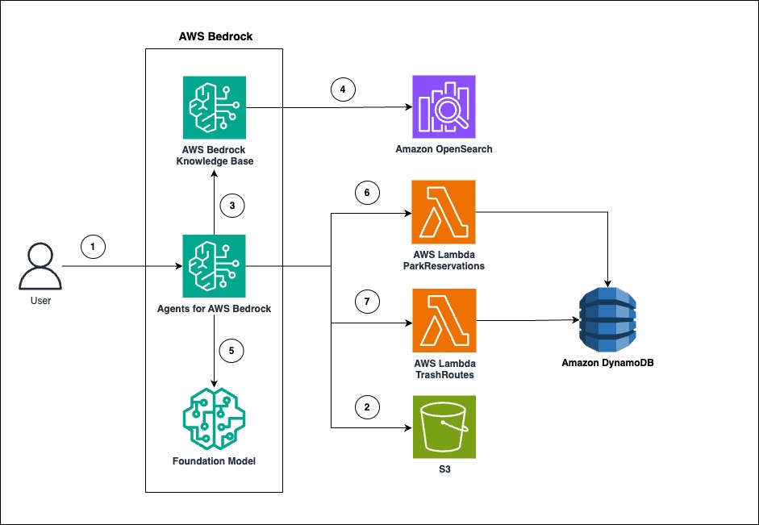

## Deploy an Amazon Bedrock Agent with a custom tool using AWS SAM

It provides a simple example for how to deploy an Amazon Bedrock Agent using AWS SAM. This project deploys an Amazon 
Bedrock Agent together with an example AWS Lambda backed tool.

## Abstract

Agents for Amazon Bedrock securely connects to your company's data sources, and augments the user request with the right information to generate an accurate response. You can use Amazon Bedrock Agents to use LLM's with your data and API's to build sophisticated AI interactions that rely on your internal knowledge bases and can take specific actions in your environment. Many organizations rely on infrastructure as code to manage resources repeatably and efficiently. This blog shows how you can deploy an Amazon Bedrock Agent with a custom tool using AWS SAM.

## Architecture


This architecture can be built using these AWS Services:

* [**Amazon Bedrock**](https://aws.amazon.com/bedrock/) is a fully managed service that offers a choice of high-performing foundation models (FMs) from leading AI companies like AI21 Labs, Anthropic, Cohere, Meta, Mistral AI, Stability AI, and Amazon through a single API, along with a broad set of capabilities you need to build generative AI applications with security, privacy, and responsible AI. In this diagram, Amazon Bedrock runtime serves as the central orchestrator, seamlessly integrating Amazon Bedrock Agents, Amazon Bedrock Knowledge Base, and Amazon Bedrock Managed Foundation Models.

    * [**Managed Foundation Models**](https://aws.amazon.com/bedrock/): Amazon Bedrock offers managed foundational models that simplify the implementation of AI solutions for businesses. Users interact with Agents for AWS Bedrock, which utilize the managed Foundation Model to process queries and generate responses. The system leverages pre-trained AI models, allowing the application to use advanced language processing capabilities without building models from scratch. 

    * [**Amazon Bedrock Agents**](https://aws.amazon.com/bedrock/agents/): Amazon Bedrock Agents securely connects to your company's data sources, and augments the user request with the right information to generate an accurate response. This architecture leverages Amazon Bedrock Agents to interpret user requests and orchestrate interactions with other services for park reservations and trash routes.

        * Large Language Models (LLMs) and Foundational Models (FMs) are trained on diverse data. However, they do not have access to real-time information or external systems by default. We can use Amazon Bedrock Agents to build tool functionality. This involves using AWS Lambda functions that the Amazon Bedrock Agent can call to execute specific tasks. In this diagram, we can build a tool to fetch park reservations and trash routes information.

    * [**Amazon Bedrock Knowledge Bases**](https://aws.amazon.com/bedrock/knowledge-bases/) is a fully managed capability link that helps you implement the entire Retrieval Augmented Generation (RAG) workflow from ingestion to retrieval and prompt augmentation without having to build custom integrations to data sources and manage data flows. In this diagram, you can ingest content from the repositories such as Amazon Simple Storage Service (Amazon S3).

* [**Amazon Simple Storage Service (Amazon S3)**](https://aws.amazon.com/s3/) is an object storage service offering industry-leading scalability, data availability, security, and performance. In this diagram, Amazon S3 is being used to store the city policy documents relating to park reservations and trash routes in a secure and scalable object storage. 

* [**Amazon OpenSearch Service**](https://aws.amazon.com/opensearch-service/) is a managed service that makes it easy to deploy, operate, and scale OpenSearch clusters in the AWS Cloud. In the architecture, the Amazon OpenSearch Service is running an OpenSearch cluster which is the target for our semantic index results from the embeddings model. OpenSearch supports a KNN index that can be used with text embeddings. 

* [**AWS Lambda**](https://aws.amazon.com/lambda/) is a serverless, event-driven compute service that lets you run code for virtually any type of application or backend service without provisioning or managing servers. In this architecture, AWS Lambda provides a serverless compute environment to execute two actions based on the user query. One is with park reservations and the other one is trash routes. 

* [**Amazon DynamoDB**](https://aws.amazon.com/dynamodb/) is a serverless, NoSQL database service that enables you to develop modern applications at any scale. In this architecture, Dynamo DB stores and retrieves data points related to the two action groups based on the user conversations with Bedrock Agent. 

## User flow

1. The user initiates interaction with the Agents for AWS Bedrock.
2. The Agent interacts directly with Amazon S3 to access or store additional data as needed.
3. The Agent queries the AWS Bedrock Knowledge Base for relevant information.
4. The Knowledge Base leverages Amazon OpenSearch for efficient data retrieval and search capabilities.
5. To process complex queries and generate responses, the Agent utilizes the Foundation Model.
6. For specific actions related to park reservations,  a. Agent invokes AWS Lambda ParkReservations function. b. Function interacts with Amazon DynamoDB to store or retrieve data.
7. For tasks related to trash routes,a. Agent invokes AWS Lambda TrashRoutes function. b. Function interacts with Amazon DynamoDB to store or retrieve data.

## Prerequisites

- git
- make
- python
- SAM CLI (Install the SAM CLI)

## Deploy/Test the application

The Serverless Application Model Command Line Interface (SAM CLI) is an extension of the AWS CLI that adds functionality for building and testing applications. 


### 1. Clone the Repository

Clone the repository to your local machine.

### 2. Navigate to the Project Directory

Change into the project directory.

### 3. Build and Deploy the Application

This command will build the source of your application and package to deploy your application to AWS, with a series of prompts:

```bash
make deploy
```

- **Stack Name**: The name of the stack to deploy to CloudFormation. This should be unique to your account and region, and a good starting point would be something matching your project name.

- **AWS Region**: The AWS region you want to deploy your app to.

- **Confirm changes before deploy**: If set to yes, any change sets will be shown to you before execution for manual review. If set to no, the AWS SAM CLI will automatically deploy application changes.

- **Allow SAM CLI IAM role creation**: AWS SAM templates often create IAM roles with minimum required permissions to access AWS services. To deploy a CloudFormation stack that creates or modifies IAM roles, you must provide the `CAPABILITY_IAM` capability. If you don't specify this capability, you'll need to add `--capabilities CAPABILITY_IAM` to the `make deploy` command.

- **Save arguments to samconfig.toml**: If set to yes, your choices will be saved to a configuration file inside the project, so that in the future you can just re-run `make deploy` without parameters to deploy changes to your application.
